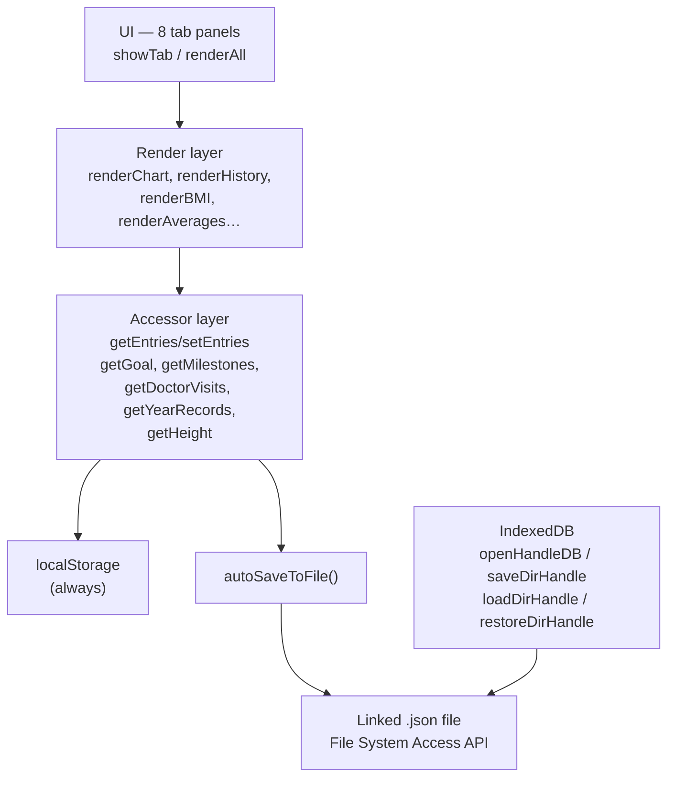

# 🗺️ Weight Tracker — Workspace Map

> [!NOTE]
> **What this is**
> A **single-file** HTML/JS weight & food tracking app. No build step, no server, no dependencies.
> Open `weight-tracker.html` in Chrome/Edge and it links directly to a local `.json` data file
> via the **File System Access API**.

---

## 📁 File Inventory

| File | Size | Role | Tracked? |
|---|---:|---|---|
| `weight-tracker.html` | 82 KB | **The app.** HTML + CSS + JS, all inline (2066 lines) | ✅ |
| `weight-tracker-data_2026.json` | 84 KB | **Live data** for 2026 — real personal health data | ✅ |
| `weight-tracker - Copy.html` | 76 KB | Backup snapshot of the app (May 19, stale) | ✅ |
| `Readme.md` | 5.5 KB | User-facing docs — every tab & feature described | ✅ |
| `CLAUDE.md` | 865 B | Agent instructions + key-files table | ✅ |
| `MEMORY.md` | 431 B | Session memory: root causes, conventions, change log | ✅ |
| `Blank Weight-Tracker Page.png` | 18 KB | Screenshot of the empty app | ✅ |
| `.gitignore` | 145 B | OS junk, `*.tmp`, Dropbox conflicted copies | ✅ |

> [!WARNING]
> **Data is real, not sample**
> `weight-tracker-data_2026.json` contains actual personal health records and **is committed** to the
> private repo. Treat it as sensitive — never publish, never move to a public remote.

---

## 🧩 App Anatomy — `weight-tracker.html`

```
lines    1–6    <head>
lines    7–261  <style>        all CSS
lines  262–561  <body>         markup + 8 tab panels
lines  562–2066 <script>       all JS
line   2048     restoreDirHandle()   ← boot entry point
```

### Tab panels (DOM ids)

| Tab | `id` | Renders via |
|---|---|---|
| Log Entry | `tab-log` | `saveEntry` · `renderGoal` · `renderBMI` · `renderMilestones` · `renderChart` |
| History | `tab-history` | `renderHistory` · `toggleHistorySort` |
| Food Analyzer | `tab-analyze` | `analyzeFoods` · `renderAnalyzeResults` · `setAnalyzeMode/Sort` |
| Doctors | `tab-doctors` | `renderDoctorVisits` · `saveDoctorVisit` |
| Yearly Records | `tab-records` | `renderYearRecords` · `saveYearRecord` |
| Projection | `tab-projection` | `calculateProjection` · `renderProjectionDefaults` |
| Averages | `tab-averages` | `renderDailyRates` · `renderAverages` · `renderAveragesChart` |
| Export / Import | `tab-data` | `exportJSON` · `exportCSV` · `importJSON` |

Switching is handled by `showTab(name, btn)`; `renderAll()` is the global refresh.

### Layers



### Persistence — the tricky part

| Piece | Function(s) | Note |
|---|---|---|
| Directory handle store | `openHandleDB`, `saveDirHandle`, `loadDirHandle` | Kept in **IndexedDB** so the folder survives reloads |
| Boot restore | `restoreDirHandle()` | Runs on load; last line of the script |
| Folder pick | `pickDataDirectory()` | One-time **Browse**; choose *Every Visit* at the Chrome prompt |
| Open / create | `openDataFile`, `createDataFile`, `loadFromHandle` | File picker UI: `showFilePicker` / `selectFileFromPicker` |
| Auto-save | `autoSaveToFile()` | Fires on every mutation |
| Status dot | `updateStorageStatus(linked, errorMsg)` | 🟢 linked to file · 🟡 localStorage only |
| Whole-state I/O | `getAllData()` / `loadAllData(data)` | The JSON serialization boundary |

---

## 🗃️ Data Schema — `weight-tracker-data_2026.json`

```jsonc
{
  "entries": [            // 191 records
    { "date": "2026-02-01", "weight": 259.7, "foods": [], "notes": "" }
  ],
  "goal": 208,            // target weight (lbs)
  "doctorVisits": [ /* 18 */ ],   // date, doctor, officeWeight, homeWeight, notes
  "yearRecords":  [ /* 16 */ ],   // year, low, high
  "milestones":   [ /*  1 */ ],   // id, weight, dueDate
  "height": 70,           // inches — drives BMI
  "savedAt": "2026-08-11T16:23:41.768Z"
}
```

Entries are stored **oldest→newest**; `entries[entries.length - 1]` is the current weight.
Doctor visits are held **newest-first** — code that walks them relies on that ordering.

---

## 🌿 Git

**Remote:** `vtak007/Weight-Tracker` — private. Normally a single `main` branch.

**Workflow:** feature branch → verify in the browser → fast-forward merge to `main` → delete the
branch. No PRs, no CI.

> [!NOTE]
> **Most of the history is data churn**
> `weight-tracker-data_2026.json` changes on nearly every use, so the majority of commits are pure
> data updates with no code in them. When reading history for *code*, start from these:
>
> | Commit | Change |
> |---|---|
> | `7e38253` | "Current vs. Home" pill moved to each doctor's latest visit (`renderDoctorVisits`) |
> | `cfce9d6` | Milestone due dates; data-directory picker with IndexedDB persistence |
> | `0274cfe` | Initial commit — the whole app |

> [!TIP]
> **This section deliberately records no branch tips, commit counts or working-tree state.**
> That churns on every commit and goes stale immediately — `git log --oneline -10` and
> `git status` are authoritative and always current. Only durable facts belong here.

---

## 🛠️ Working Notes

- **No build, no test suite.** Verify by opening the file in a browser.
- **Requires** Chrome/Edge 86+ (File System Access API). Firefox/Safari fall back to `localStorage`.
- **Editing the app** means editing one 2000-line file — CSS, markup, and JS all live in it.
- `weight-tracker - Copy.html` is a **manual** backup and is already months behind; git is the real safety net.
- Project conventions & confirmed root causes belong in `MEMORY.md`; feature docs in `Readme.md`.

### Common jumping-off points

| I want to… | Go to |
|---|---|
| Change how weight is charted | `renderChart` (~1157), `computeMovingAvg` (~1149) |
| Touch BMI logic | `renderBMI` (~1000), `bmiCategory` (~982) |
| Adjust food matching | `analyzeFoods` (~1360), `parseFoods` (~2013) |
| Change what's saved | `getAllData` (~658), `loadAllData` (~670) |
| Fix a file-linking bug | `restoreDirHandle` (~744) → `openDataFile` (~793) |

---

## 🔗 Related

- `Readme.md` — full feature documentation per tab
- `CLAUDE.md` — instructions for agent sessions in this folder
- `MEMORY.md` — running change log and ruled-out theories
