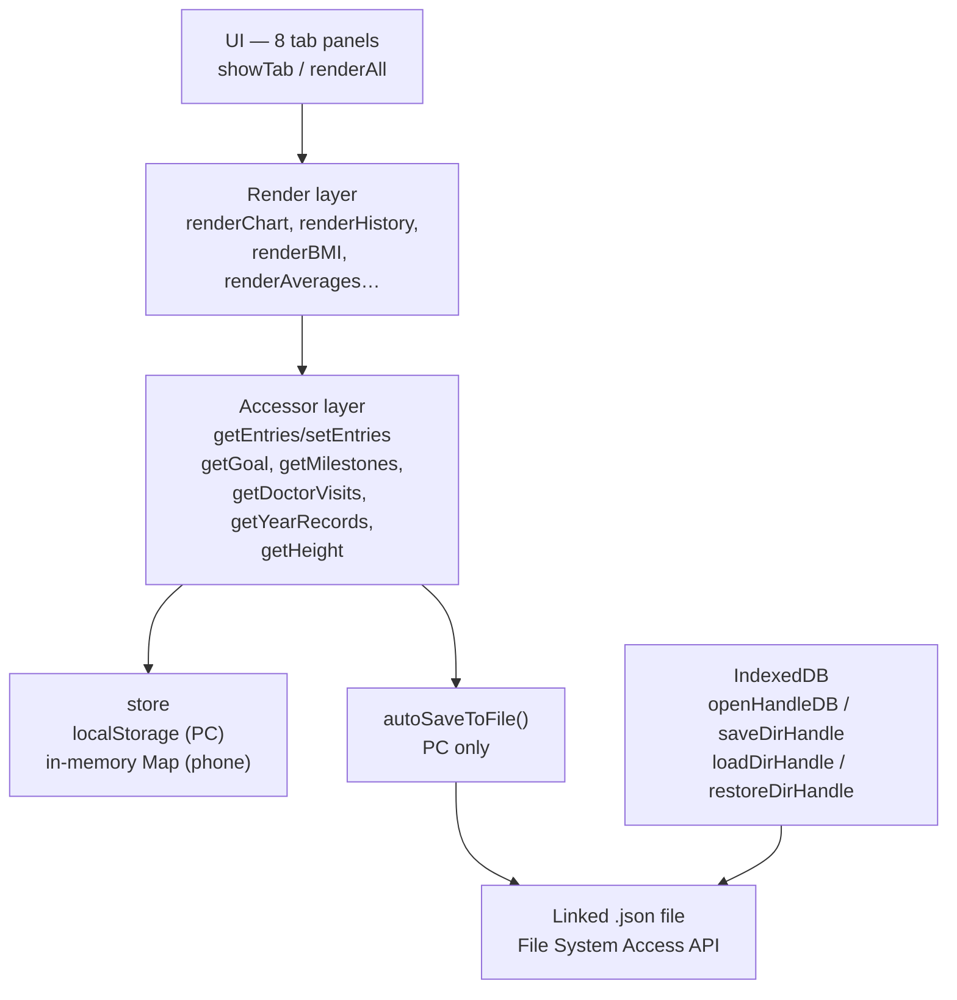

# 🗺️ Weight Tracker — Workspace Map

> [!NOTE]
> **What this is**
> A **single-file** HTML/JS weight & food tracking app. No build step, no dependencies.
> On the PC, open `weight-tracker.html` in Chrome/Edge; it links to a local `.json` data file via the
> **File System Access API**. A read-only copy is served to a phone from NFO web hosting behind a password.

Files and what they are: see the **Key Files** table in `CLAUDE.md`. Backup (rclone to Google Drive):
see `CLAUDE.md`. Feature docs: `README.md`.

> [!WARNING]
> `weight-tracker-data_2026.json` is **real personal health data**, committed to the private repo.
> Never publish it or move it to a public remote.

---

## 🧩 App Anatomy — `weight-tracker.html`

One file: `<head>`, `<style>` (all CSS), `<body>` (markup + 8 tab panels), `<script>` (all JS).
`restoreDirHandle()` is the boot entry point (PC mode); `loadReadOnlyData()` is the boot path in phone mode.
Both are called at the end of the script.

### Tab panels (DOM ids)

| Tab | `id` | Renders via |
|---|---|---|
| Log Entry | `tab-log` | `saveEntry` · `renderGoal` · `renderBMI` · `renderMilestones` · `renderChart` |
| History | `tab-history` | `renderHistory` · `toggleHistorySort` |
| Food Analyzer | `tab-analyze` | `analyzeFoods` · `renderAnalyzeResults` · `setAnalyzeMode/Sort` |
| Doctors | `tab-doctors` | `renderDoctorVisits` · `saveDoctorVisit` |
| Yearly Records | `tab-records` | `renderYearRecords` · `saveYearRecord` |
| Projection | `tab-projection` | `calculateProjection` · `renderProjectionDefaults` |
| Averages | `tab-averages` | `renderDailyRates` · `renderAverages` · `renderAveragesChart` |
| Export / Import | `tab-data` | `exportJSON` · `exportCSV` · `importJSON` (hidden in read-only mode) |

Switching is handled by `showTab(name, btn)`; `renderAll()` is the global refresh.

### Layers


```mermaid
flowchart TD
  A["UI — 8 tab panels<br/>showTab / renderAll"] --> B["Render layer<br/>renderChart, renderHistory,<br/>renderBMI, renderAverages…"]
  B --> C["Accessor layer<br/>getEntries/setEntries<br/>getGoal, getMilestones,<br/>getDoctorVisits, getYearRecords,<br/>getHeight"]
  C --> D["store<br/>localStorage (PC)<br/>in-memory Map (phone)"]
  C --> E["autoSaveToFile()<br/>PC only"]
  E --> F["Linked .json file<br/>File System Access API"]
  G["IndexedDB<br/>openHandleDB / saveDirHandle<br/>loadDirHandle / restoreDirHandle"] --> F
```

### Persistence — the tricky part (PC mode)

| Piece | Function(s) | Note |
|---|---|---|
| Directory handle store | `openHandleDB`, `saveDirHandle`, `loadDirHandle` | Kept in **IndexedDB** so the folder survives reloads |
| Boot restore | `restoreDirHandle()` | If the saved handle still has permission (`queryPermission`, no prompt), it silently re-finds the single `.json` file and calls `loadFromHandle(handle, {silent:true})` |
| Folder pick | `pickDataDirectory()` | One-time **Browse**; choose *Every Visit* at the Chrome prompt |
| Open / create | `openDataFile`, `createDataFile`, `loadFromHandle` | File picker UI: `showFilePicker` / `selectFileFromPicker` |
| Auto-save | `autoSaveToFile()` | Fires on every mutation; skipped when `READ_ONLY` |
| Status dot | `updateStorageStatus(linked, errorMsg)` | 🟢 linked to file · 🟡 localStorage only |
| Whole-state I/O | `getAllData()` / `loadAllData(data)` | The JSON serialization boundary |

### Read-only phone mode

| Piece | Symbol | Note |
|---|---|---|
| Mode switch | `READ_ONLY` | True only when served over `http:`/`https:`; `file://` on the PC stays normal |
| Storage | `store` | In-memory Map when `READ_ONLY`, `localStorage` otherwise — all reads/writes go through it |
| Data load | `loadReadOnlyData()` | Fetches `data.php`; 401 → login page; bad/`null`/non-OK body → "Could not load data" |
| Hiding write UI | `.ro-hide` / `.ro-only` CSS classes, `body.readonly` | Add Entry, Export/Import, Edit/Delete hidden; milestone due-date input disabled |

---

## 🌐 Phone site (NFO web hosting)

| Piece | Where | Note |
|---|---|---|
| PHP gate | `server/` → `/public/FMJfiles/weight/` | `index.php` (login/logout, serves `app.html`), `data.php` (authenticated JSON), `lib.php` (token, cookie, rate limit), `.htaccess` (https redirect, blocks `lib.php`/`app.html`), `robots.txt` |
| App copy | `weight-tracker.html` → `app.html` | Same file as the PC app; deployed under a different name |
| Private data | `/weight-private/` on NFO (outside web root) | `weight-tracker-data_*.json` and `auth-config.php` (bcrypt hash + token secret) |
| Deploy | `deploy/deploy-web.ps1` | Refuses to run from an uncommitted tree; Windows PowerShell 5.1 only |
| Daily data upload | `deploy/upload-data.ps1`, task `Upload Weight Tracker JSON to NFO` (10:00) | Uploads to `*.part` then renames; log in `Documents\upload-weighttracker.log` |
| Credentials | `%USERPROFILE%\weight-tracker-secrets\` | FTP creds (`save-ftp-creds.ps1`) and `auth-config.php` source — outside the repo and Dropbox |
| Password change | `deploy/make-auth-config.py` | Writes a new `auth-config.php`; upload it to `/weight-private/`. Signs everyone out |

Tests: `deploy/tests/lib-test.php`, `deploy/tests/test-server.sh` (need a local PHP), `deploy/test_make_auth_config.py`.
Design: `docs/superpowers/specs/2026-10-03-phone-view-design.md`.

---

## 🗃️ Data Schema — `weight-tracker-data_2026.json`

```jsonc
{
  "entries": [            // N records
    { "date": "2026-02-01", "weight": 259.7, "foods": [], "notes": "" }
  ],
  "goal": 208,            // target weight (lbs)
  "doctorVisits": [ ],    // date, doctor, officeWeight, homeWeight, notes
  "yearRecords":  [ ],    // year, low, high
  "milestones":   [ ],    // id, weight, dueDate
  "height": 70,           // inches — drives BMI
  "savedAt": "2026-08-11T16:23:41.768Z"
}
```

Entries are stored **oldest→newest**; `entries[entries.length - 1]` is the current weight.
Doctor visits are held **newest-first** — code that walks them relies on that ordering.

---

## 🌿 Git

**Remote:** `vtak007/Weight-Tracker` — private. **Workflow:** feature branch → verify in the browser →
fast-forward merge to `main` → delete the branch. No PRs, no CI. The live data file is committed in the
same repo, so most commits are pure data updates.

Start reading code history from these, then use `git log` (authoritative, always current):

| Commit | Change |
|---|---|
| `7e38253` | "Current vs. Home" pill moved to each doctor's latest visit (`renderDoctorVisits`) |
| `cfce9d6` | Milestone due dates; data-directory picker with IndexedDB persistence |
| `0274cfe` | Initial commit — the whole app |

---

## 🛠️ Working Notes

- **No build, no test suite for the app.** Verify by opening the file in a browser (the phone-site gate has PHP/Python tests, see above).
- **Editing the app** means editing one large file — CSS, markup and JS all live in it.
- `MEMORY.md` (project root) holds confirmed root causes and a change log.

### Common jumping-off points

| I want to… | Go to |
|---|---|
| Change how weight is charted | `renderChart()`, `computeMovingAvg()` |
| Touch BMI logic | `renderBMI()`, `bmiCategory()` |
| Adjust food matching | `analyzeFoods()`, `parseFoods()` |
| Change what's saved | `getAllData()`, `loadAllData()` |
| Fix a file-linking bug | `restoreDirHandle()` → `openDataFile()` |
| Change what the phone shows or hides | `READ_ONLY`, `.ro-hide` / `.ro-only`, `loadReadOnlyData()` |
| Change login, lockout or cookie rules | `server/lib.php`, `server/index.php` |

Search for the name rather than scrolling to a line number — names are unique within `weight-tracker.html`.
